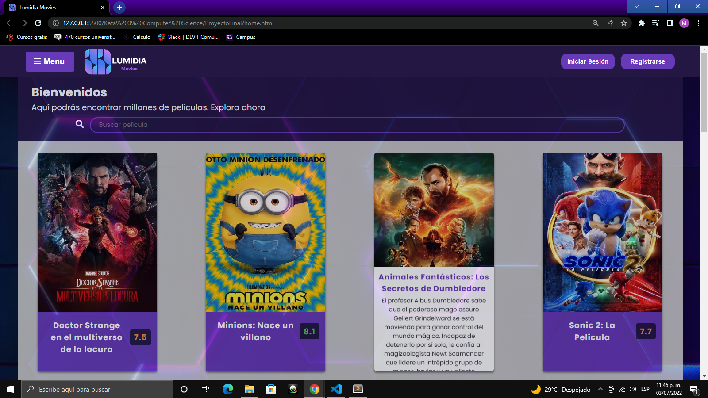
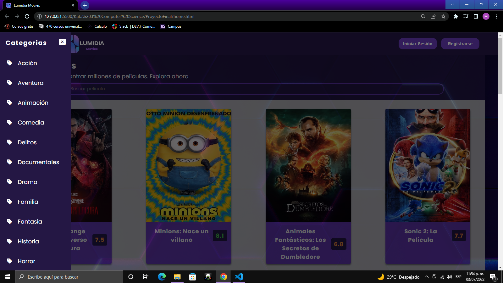
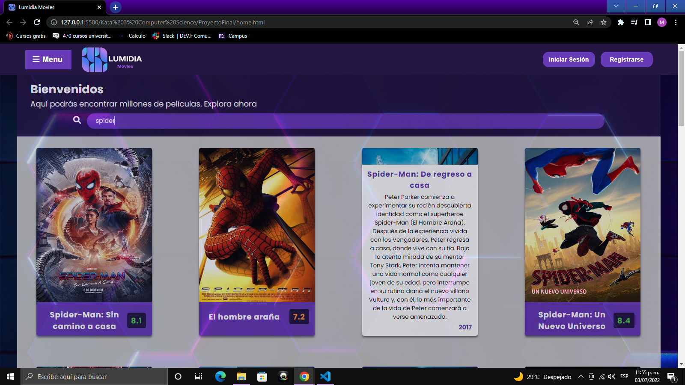

# Lumidia Movies

Proyecto similar a un trepositorio de peliculas utilizando una API de TMDB, en cual se muestran las peliculas con su titulo, con su calificación que a su vez estan seccionadas en tres colores verde para calificaciones igual y mayores a 8, naranja que son mayores o iguales a 6 y rojo las que son menores a 6 también muestra su descripción de la pelicula al pasar el cursor sobre la tarjeta así como el año en que fue estrenada.

En la parte superior el encabezado cuenta con la sección de menú que despliega las categorías o generos de películas en las que se pueden buscar.

En la parte de bienvenidos su funcionalidad es mediante un form que contiene un input de busqueda en el cual se ingresa cualquier palabra y muestras las peliculas relacionadas con dicha frase.

